Math 50 Fall 2017, Homework \#6
================

In collaboration with (no copying of code!): Sam, Itzel, Summer

**NOTE: For your homework download and use the template**
(<https://math.dartmouth.edu/~m50f17/HW6.Rmd>)

**Read the green comments in the rmd file to see where your answers
should go.**

#### Lets first look at the scatter plot for the windmill data, and visually check the straight line fit.

``` r
windmill <- read.table("https://math.dartmouth.edu/~m50f17/windmill.csv", header=T)
plot(windmill$velocity, windmill$DC, xlab = "wind velocity", ylab = "DC current")
fit <- lm(DC~velocity, data = windmill)
abline(fit$coefficients, col="red")
```

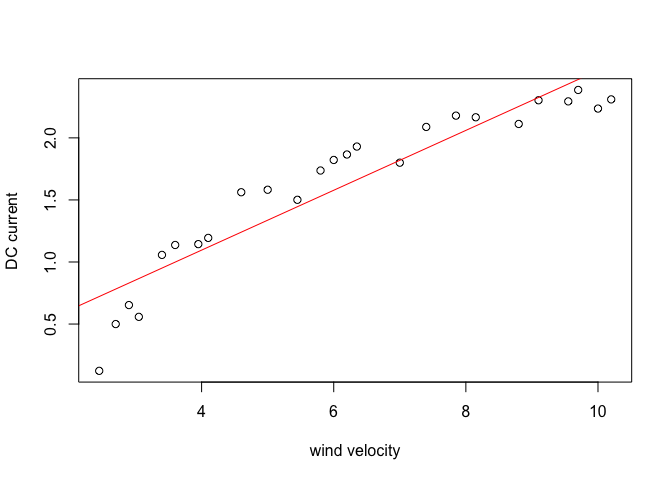<!-- -->

#### The summary statistics are below, *R*<sup>2</sup> is about 0.87. The residual plot below suggests that the relation might be non-linear. When you look at the above scatter diagram one might think the straight line model seems OK, however the residual plot below amplifies the nonlinearity. Why? Can we also see this by carefully looking at the scatter plot above?

``` r
summary(fit)
```

    ## 
    ## Call:
    ## lm(formula = DC ~ velocity, data = windmill)
    ## 
    ## Residuals:
    ##      Min       1Q   Median       3Q      Max 
    ## -0.59869 -0.14099  0.06059  0.17262  0.32184 
    ## 
    ## Coefficients:
    ##             Estimate Std. Error t value Pr(>|t|)    
    ## (Intercept)  0.13088    0.12599   1.039     0.31    
    ## velocity     0.24115    0.01905  12.659 7.55e-12 ***
    ## ---
    ## Signif. codes:  0 '***' 0.001 '**' 0.01 '*' 0.05 '.' 0.1 ' ' 1
    ## 
    ## Residual standard error: 0.2361 on 23 degrees of freedom
    ## Multiple R-squared:  0.8745, Adjusted R-squared:  0.869 
    ## F-statistic: 160.3 on 1 and 23 DF,  p-value: 7.546e-12

``` r
plot(fitted.values(fit), rstudent(fit), xlab = "y", ylab = "R-Student residuals", main = "Windmill - Residual Plot")
abline(c(0,0), col="red")
```

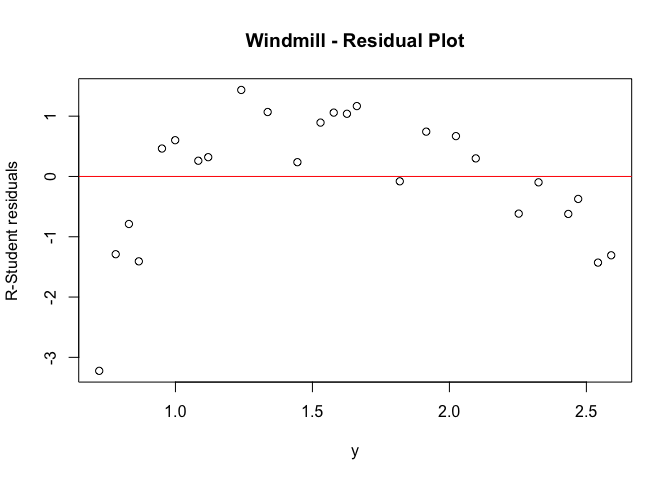<!-- -->

#### Also note that it looks like that there is a potential outlier and however this might change when we fix the model. It seems consistent with the rest (visually). Start with fitting a quadratic model.

``` r
fit2 <- lm(DC~poly(velocity, degree = 2), data = windmill)
summary(fit2)
```

    ## 
    ## Call:
    ## lm(formula = DC ~ poly(velocity, degree = 2), data = windmill)
    ## 
    ## Residuals:
    ##      Min       1Q   Median       3Q      Max 
    ## -0.26347 -0.02537  0.01264  0.03908  0.19903 
    ## 
    ## Coefficients:
    ##                             Estimate Std. Error t value Pr(>|t|)    
    ## (Intercept)                  1.60960    0.02453  65.605  < 2e-16 ***
    ## poly(velocity, degree = 2)1  2.98825    0.12267  24.359  < 2e-16 ***
    ## poly(velocity, degree = 2)2 -0.97493    0.12267  -7.947 6.59e-08 ***
    ## ---
    ## Signif. codes:  0 '***' 0.001 '**' 0.01 '*' 0.05 '.' 0.1 ' ' 1
    ## 
    ## Residual standard error: 0.1227 on 22 degrees of freedom
    ## Multiple R-squared:  0.9676, Adjusted R-squared:  0.9646 
    ## F-statistic: 328.3 on 2 and 22 DF,  p-value: < 2.2e-16

``` r
plot(windmill$velocity, windmill$DC, xlab = "wind velocity", ylab = "DC current")
 
lines(sort(windmill$velocity), fitted(fit2)[order(windmill$velocity)], col='red') 
```

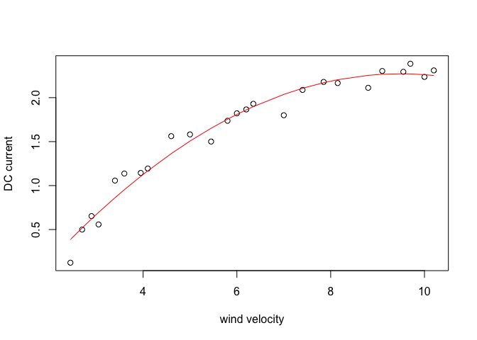<!-- -->

#### This seems to fix the curved nature of the data, however the application domain suggests to use a model of the form 
$$ y = \\beta\_0 + \\beta\_1 \\frac{1}{x} + \\varepsilon $$
 Note that there doesn’t seem a potential outlier in the new model.

``` r
velRep = 1/windmill$velocity
DC <- windmill$DC

plot(velRep, windmill$DC, xlab = "1/velocity", ylab = "DC current")
fit3 <- lm(DC~velRep)
abline(fit3$coefficients, col="red")
```

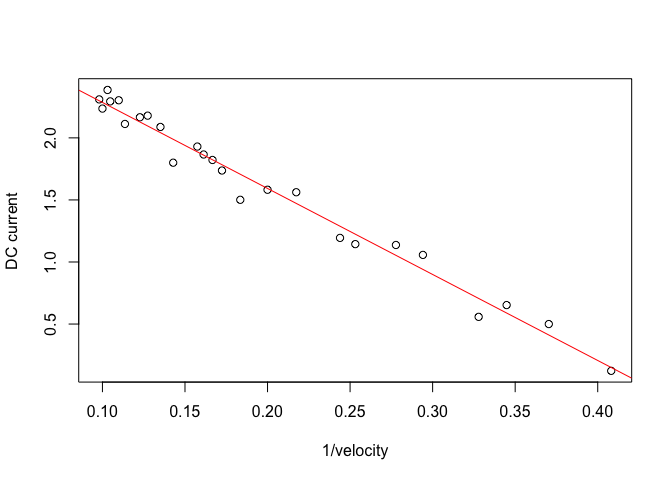<!-- -->

``` r
summary(fit3)
```

    ## 
    ## Call:
    ## lm(formula = DC ~ velRep)
    ## 
    ## Residuals:
    ##      Min       1Q   Median       3Q      Max 
    ## -0.20547 -0.04940  0.01100  0.08352  0.12204 
    ## 
    ## Coefficients:
    ##             Estimate Std. Error t value Pr(>|t|)    
    ## (Intercept)   2.9789     0.0449   66.34   <2e-16 ***
    ## velRep       -6.9345     0.2064  -33.59   <2e-16 ***
    ## ---
    ## Signif. codes:  0 '***' 0.001 '**' 0.01 '*' 0.05 '.' 0.1 ' ' 1
    ## 
    ## Residual standard error: 0.09417 on 23 degrees of freedom
    ## Multiple R-squared:   0.98,  Adjusted R-squared:  0.9792 
    ## F-statistic:  1128 on 1 and 23 DF,  p-value: < 2.2e-16

``` r
plot(fitted.values(fit), rstudent(fit3), xlab = "fitted values", ylab = "Studentized residuals", main = "Residuals - reciprocal model")
abline(c(0,0), col="red")
```

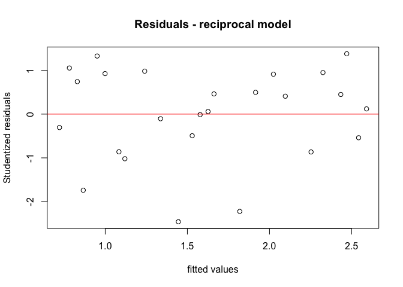<!-- -->

## Question-1

-   Recall the phytoplankton population data is given at :
-   <https://math.dartmouth.edu/~m50f17/phytoplankton.csv>
-   where headers are
    -   pop : population of phytoplankton (*y*)
    -   subs2 : concentration of substance-2 (*x*)

### Part (a)

-   Plot the scatter diagram for pop \~ subs2. Do you think a straight
    line model is adequate? Fit a straight line model and support your
    argument with summary statistics.

``` r
data = read.table("https://math.dartmouth.edu/~m50f17/phytoplankton.csv",header=T, sep=",")
pop = data$pop
subs2=data$subs2
n = length(pop)
k = 1
plot(subs2,pop,xlab="Concentration of subs2",ylab="Population",main="Population vs. Concentration of subs2")
fit = lm(pop~subs2,data = data)
abline(fit$coefficients,col="red")
```

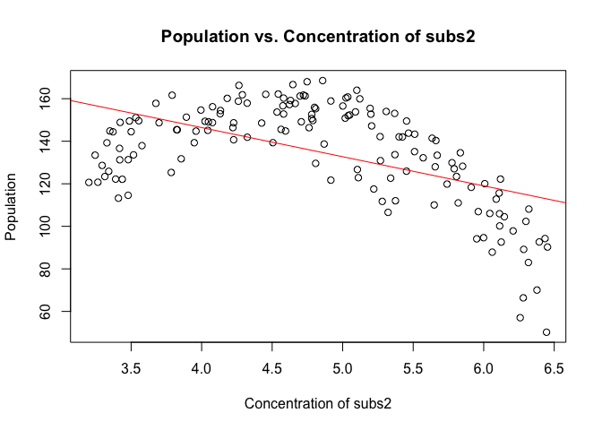<!-- -->

``` r
summary(fit)
```

    ## 
    ## Call:
    ## lm(formula = pop ~ subs2, data = data)
    ## 
    ## Residuals:
    ##     Min      1Q  Median      3Q     Max 
    ## -62.645 -12.577   3.176  16.593  33.879 
    ## 
    ## Coefficients:
    ##             Estimate Std. Error t value Pr(>|t|)    
    ## (Intercept)  201.250      8.672  23.206  < 2e-16 ***
    ## subs2        -13.712      1.759  -7.793 1.06e-12 ***
    ## ---
    ## Signif. codes:  0 '***' 0.001 '**' 0.01 '*' 0.05 '.' 0.1 ' ' 1
    ## 
    ## Residual standard error: 20.14 on 148 degrees of freedom
    ## Multiple R-squared:  0.291,  Adjusted R-squared:  0.2862 
    ## F-statistic: 60.74 on 1 and 148 DF,  p-value: 1.063e-12

``` r
stdRes = rstandard(fit)
rStuRes = rstudent(fit)
qqnorm(rStuRes, datax = TRUE, main="Normal Probability Plot")
qqline(rStuRes, datax = TRUE)
```

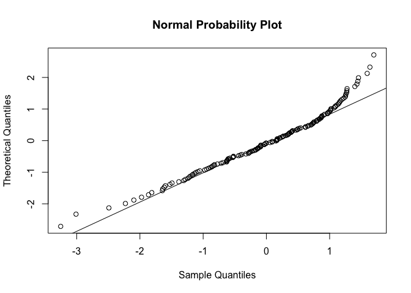<!-- -->

``` r
plot(fitted.values(fit), rstudent(fit), xlab = "y", ylab = "R-Student residuals", main = "Population vs. Residual Plot")
abline(c(0,0), col="red")
```

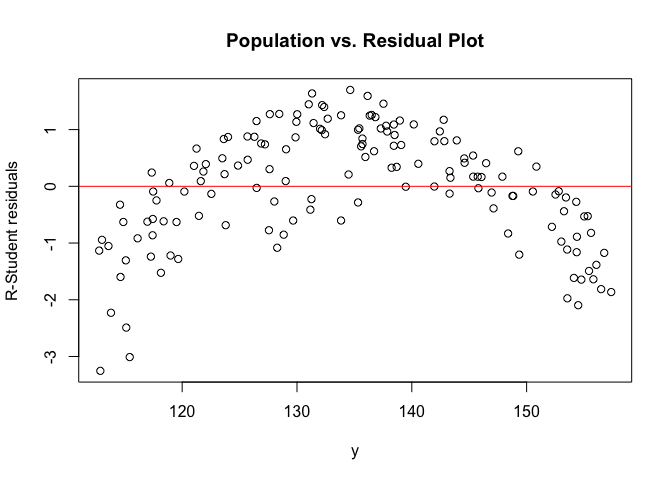<!-- -->

``` r
SS_res_a = sum((pop - predict(fit))^2)
SS_t = sum((pop - mean(pop))^2)
MS_res_a = SS_res_a/(n - (k+1))
```

The straight line model does not seem adequate because of the nonlinear
trend in the scatter plot data. The summary statistics reveal
*R*<sup>2</sup> and adjusted *R*<sup>2</sup> to be 0.291 and 0.286
respectively, and MSres was calculated to be 405.5107192. These low
*R*<sup>2</sup> values suggest the linear model is not a great fit for
the phytoplankton data, while the large MSres value (compared to the
MSres found in part (c)) indicates excessively high variance due to the
model. The residuals plot shows an evident structure and the normal
probability plot shows the residuals don’t follow the line, suggesting
the need for other regressors and a violation of the normality
assumption.

### Part (b)

-   Do you suggest to use Box-Cox method? If not explain, if so apply
    the method and demonstrate the improvement.

``` r
subs2Test = subs2
library(MASS)
bc= boxcox(pop ~ subs2Test)
```

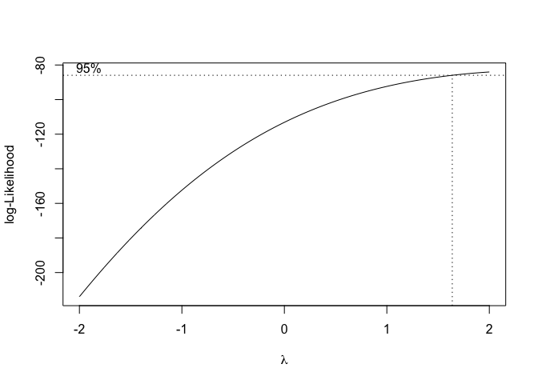<!-- -->

``` r
lambda = bc$x[which.max(bc$y)]
new_pop = pop^lambda
fit2 = lm(new_pop ~ subs2, data = data)
summary(fit2)
```

    ## 
    ## Call:
    ## lm(formula = new_pop ~ subs2, data = data)
    ## 
    ## Residuals:
    ##      Min       1Q   Median       3Q      Max 
    ## -11053.9  -3712.7    281.2   3973.1   9697.5 
    ## 
    ## Coefficients:
    ##             Estimate Std. Error t value Pr(>|t|)    
    ## (Intercept)  34379.8     2171.2  15.835  < 2e-16 ***
    ## subs2        -3227.6      440.5  -7.328 1.41e-11 ***
    ## ---
    ## Signif. codes:  0 '***' 0.001 '**' 0.01 '*' 0.05 '.' 0.1 ' ' 1
    ## 
    ## Residual standard error: 5041 on 148 degrees of freedom
    ## Multiple R-squared:  0.2662, Adjusted R-squared:  0.2613 
    ## F-statistic: 53.69 on 1 and 148 DF,  p-value: 1.406e-11

``` r
stdRes = rstandard(fit2)
rStuRes = rstudent(fit2)
qqnorm(rStuRes, datax = TRUE, main="Normal Probability Plot for Box-Cox")
qqline(rStuRes, datax = TRUE)
```

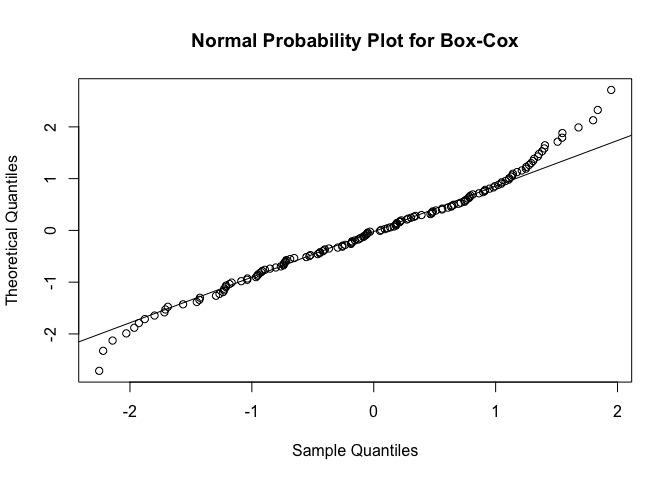<!-- -->

``` r
plot(fitted.values(fit2), rStuRes, xlab = "y", ylab = "R-Student residuals", main = "Population vs. Residual Plot for Box-Cox")
abline(c(0,0), col="red")
```

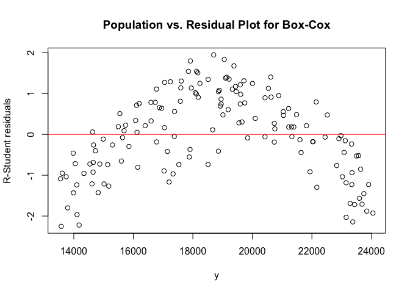<!-- -->

Because in part (a) the normal probability and residuals plots show that
the normality assumption and constant variance condition are not met, we
should try the Box-Cox method. Box-Cox method yields a transformation
with lambda: 2. Such a transformation of the response variable produces
a model with *R*<sup>2</sup> and adjusted *R*<sup>2</sup> of 0.266 and
0.261 respectively, which are marginally lower than the *R*<sup>2</sup>
values from the straight line model in part (a). This suggests the
Box-Cox method did not produce much improvement in modeling the
phytoplankton data, even though there is a slight improvement in the
normality assumption with the residuals lieing quite close to the line
in the new normal probability plot (slightly light-tailed).

### Part (c)

-   An analyst suggests to use the following model:
    -   $ y = \_0 + \_1 (x-4.5)^2 $
-   Using transformations, fit a simple linear regression model. Plot
    the scatter diagram and fitted curve (Note: it is not a straight
    line in this case). Compare *M**S*<sub>*r**e**s*</sub>,
    *R*<sup>2</sup> and the R-student residual plots with the model in
    part a.

``` r
new_subs2 = (subs2 - 4.5)^2
plot(new_subs2, pop, xlab="Concentration of (subs2 - 4.5)^2", ylab="Population", main="Analyst's Model")
fit3 = lm(pop~new_subs2)
abline(fit3$coefficients, col="red")
```

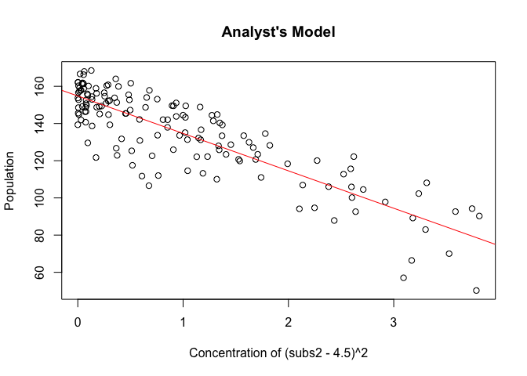<!-- -->

``` r
SS_res_c = sum((pop - predict(fit3))^2)
MS_res_c = SS_res_c/(n - (k+1))
cat("\nMS_res for Analyst's Model =",MS_res_c,"\nMS_res for Straight Line Model =",MS_res_a)
```

    ## 
    ## MS_res for Analyst's Model = 147.9643 
    ## MS_res for Straight Line Model = 405.5107

``` r
summary(fit3)
```

    ## 
    ## Call:
    ## lm(formula = pop ~ new_subs2)
    ## 
    ## Residuals:
    ##     Min      1Q  Median      3Q     Max 
    ## -35.484  -5.751   2.395   7.951  20.161 
    ## 
    ## Coefficients:
    ##             Estimate Std. Error t value Pr(>|t|)    
    ## (Intercept) 154.7877     1.3857  111.70   <2e-16 ***
    ## new_subs2   -20.1264     0.9774  -20.59   <2e-16 ***
    ## ---
    ## Signif. codes:  0 '***' 0.001 '**' 0.01 '*' 0.05 '.' 0.1 ' ' 1
    ## 
    ## Residual standard error: 12.16 on 148 degrees of freedom
    ## Multiple R-squared:  0.7413, Adjusted R-squared:  0.7395 
    ## F-statistic: 424.1 on 1 and 148 DF,  p-value: < 2.2e-16

``` r
plot(fitted.values(fit3), rstudent(fit3), xlab = "fitted values", ylab = "Studentized residuals", main = "Residuals - Analyst's model")
abline(c(0,0), col="red")
```

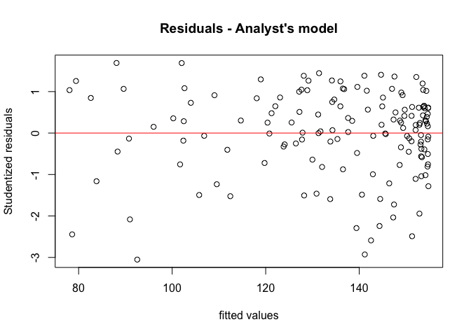<!-- -->

MS\_res for the Analyst’s model of 148 is significantly lower than
MS\_res due to the straight line model, while the *R*<sup>2</sup> and
adjusted *R*<sup>2</sup> values of 0.741 and 0.740 respectively are
significantly higher for the Analyst’s model. Additionally, residuals
for the new model are not quite within horizontal bands (the bands
slightly narrow for fitted values near 120), indicating non-constant
variance. This means the new model is a better fit to the data, but
could be better.

### Part (d)

-   Construct the probability plot for part (c). Is there a problem with
    the normality assumption? If so determine the problem (heavy tailed,
    light tailed, or something else)

``` r
stdRes = rstandard(fit3)
rStuRes = rstudent(fit3)
qqnorm(rStuRes, datax = TRUE, main="Normal Probability Plot for Analyst's Model")
qqline(rStuRes, datax = TRUE)
```

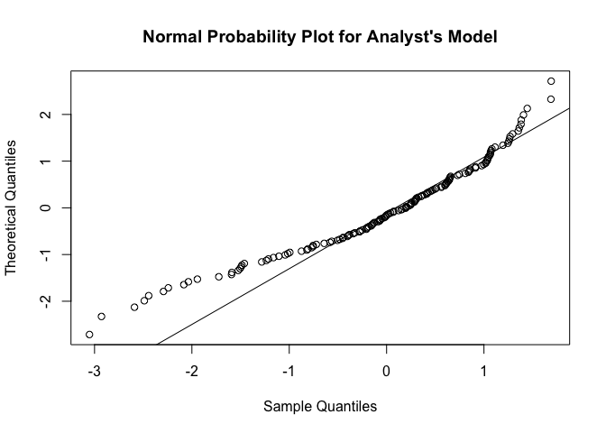<!-- -->

Based on the normal probability plot, there appears to be a problem with
the normality assumption. The problem can be described as residuals
missing the line near the extreme ends but closely following the line
near the center.

## Question-2

-   Chapter 5, Problem 2 all parts.

### Part (a)

``` r
temp = c(273,283,293,303,313,323,333,343,353,363,373)
vap_pres = c(4.6,9.2,17.5,31.8,55.3,92.5,149.4,233.7,355.1,525.8,760)
n = length(vap_pres)
k = 1
plot(temp,vap_pres,xlab="Temperature (degrees Kelvin)",ylab="Vapor Pressure (mm Hg)",main="Vapor Pressure vs. Temperature")
```

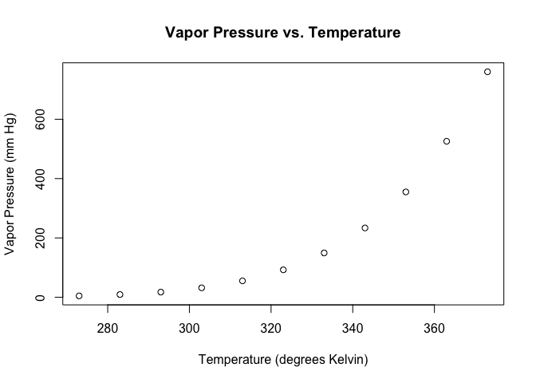<!-- -->

It does not seem likely that a straight-line model will suffice because
the slope between successive points seems to increase as temperature
increases.

### Part (b)

``` r
plot(temp,vap_pres,xlab="Temperature (degrees Kelvin)",ylab="Vapor Pressure (mm Hg)",main="Vapor Pressure vs. Temperature")
fitted = lm(vap_pres ~ temp)
abline(fitted$coefficients)
```

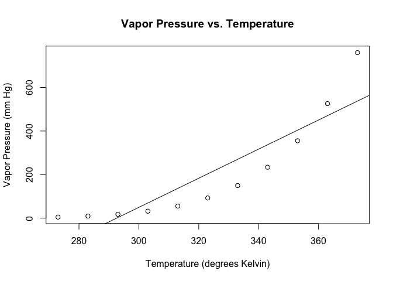<!-- -->

``` r
plot(temp,vap_pres,xlab="Temperature (degrees Kelvin)",ylab="Vapor Pressure (mm Hg)",main="Vapor Pressure vs. Temperature")
fitted = lm(vap_pres ~ temp)
abline(fitted$coefficients,col="red")
```

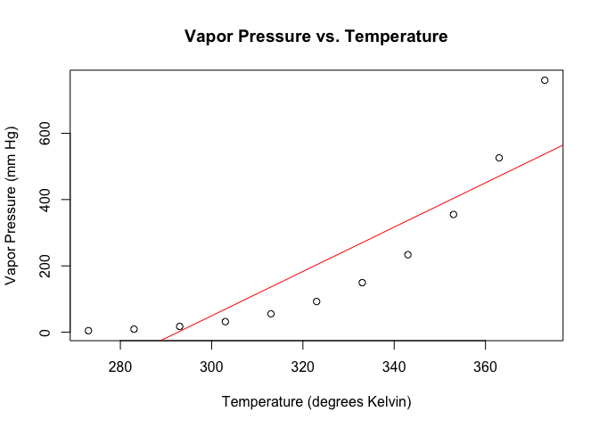<!-- -->

``` r
summary(fitted)
```

    ## 
    ## Call:
    ## lm(formula = vap_pres ~ temp)
    ## 
    ## Residuals:
    ##     Min      1Q  Median      3Q     Max 
    ## -120.63  -92.10  -37.66   64.33  222.55 
    ## 
    ## Coefficients:
    ##              Estimate Std. Error t value Pr(>|t|)    
    ## (Intercept) -1956.258    363.807  -5.377 0.000446 ***
    ## temp            6.686      1.121   5.964 0.000212 ***
    ## ---
    ## Signif. codes:  0 '***' 0.001 '**' 0.01 '*' 0.05 '.' 0.1 ' ' 1
    ## 
    ## Residual standard error: 117.6 on 9 degrees of freedom
    ## Multiple R-squared:  0.7981, Adjusted R-squared:  0.7756 
    ## F-statistic: 35.57 on 1 and 9 DF,  p-value: 0.0002117

``` r
stdRes = rstandard(fitted)
rStuRes = rstudent(fitted)
qqnorm(rStuRes, datax = TRUE, main="Normal Probability Plot")
qqline(rStuRes, datax = TRUE)
```

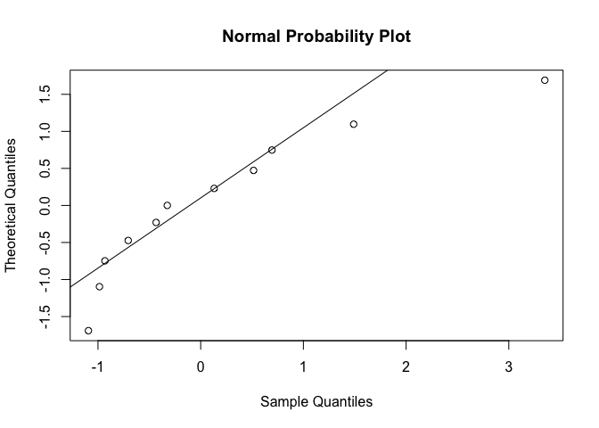<!-- -->

``` r
plot (predict(fitted), rStuRes, main = "Residuals vs. Predicted Response",xlab="Predicted Response",ylab="Residual")
abline(0,0)
```

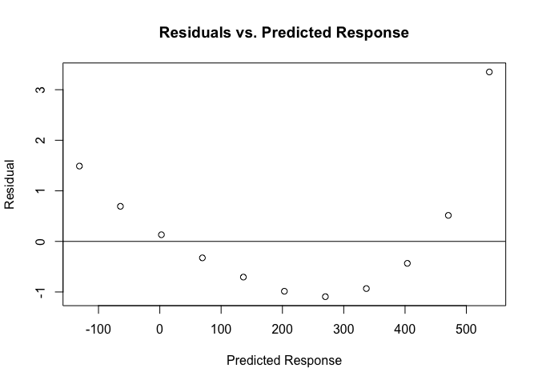<!-- -->

``` r
SS_res_b = sum((vap_pres - predict(fitted))^2)
SS_t = sum((vap_pres - mean(vap_pres))^2)
MS_res_b = SS_res_b/(n - (k+1))
```

The straight-line model yields *R*<sup>2</sup> and adjusted
*R*<sup>2</sup> values of 0.798 and 0.776 respectively, initially
suggesting a good fit to the data. MSres is found to be 1.3822545^{4},
However there is definitely an issue with the normality assumption due
to residuals deviating away from the line in the Normal Probability
plot. In addition, the pattern in the Residuals vs. Predicted Responses
plot suggests nonlinearity

### Part (c)

``` r
vapRep = log(vap_pres)
tempRep = -1/temp
plot(tempRep,vapRep,xlab="-1/temp",ylab="ln(vapor pressure)",main="ln(vapor pressure) vs. -1/temp")
fit2 = lm(vapRep ~ tempRep)
abline(fit2$coefficients,col="red") 
```

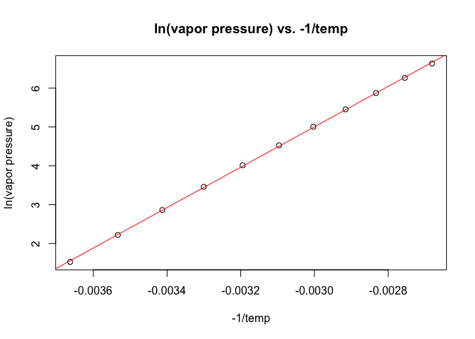<!-- -->

``` r
summary(fit2)
```

    ## 
    ## Call:
    ## lm(formula = vapRep ~ tempRep)
    ## 
    ## Residuals:
    ##       Min        1Q    Median        3Q       Max 
    ## -0.030999 -0.013107  0.004863  0.016735  0.021260 
    ## 
    ## Coefficients:
    ##              Estimate Std. Error t value Pr(>|t|)    
    ## (Intercept) 2.061e+01  6.325e-02   325.8   <2e-16 ***
    ## tempRep     5.201e+03  2.014e+01   258.3   <2e-16 ***
    ## ---
    ## Signif. codes:  0 '***' 0.001 '**' 0.01 '*' 0.05 '.' 0.1 ' ' 1
    ## 
    ## Residual standard error: 0.02067 on 9 degrees of freedom
    ## Multiple R-squared:  0.9999, Adjusted R-squared:  0.9999 
    ## F-statistic: 6.672e+04 on 1 and 9 DF,  p-value: < 2.2e-16

``` r
stdRes = rstandard(fit2)
rStuRes = rstudent(fit2)
qqnorm(rStuRes, datax = TRUE, main="Normal Probability Plot for Clausius-Clapeyron Eq.")
qqline(rStuRes, datax = TRUE)
```

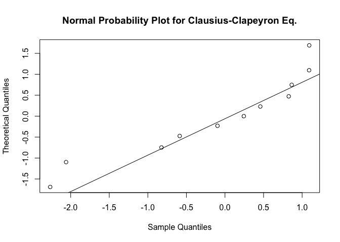<!-- -->

``` r
plot (predict(fit2), rStuRes, main = "Residuals vs. Predicted Response for Clausius-Clapeyron Eq.",xlab="New Predicted Response",ylab="Residual")
abline(0,0)
```

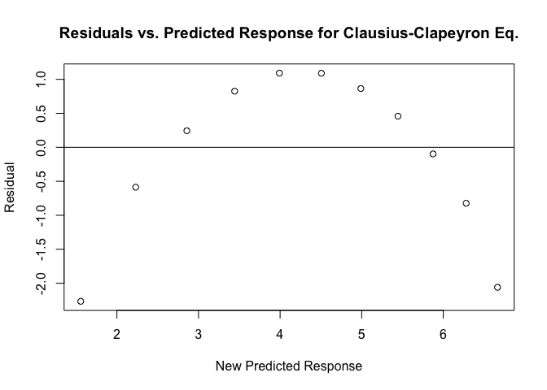<!-- -->

``` r
SS_res_c = sum((vapRep - predict(fit2))^2)
SS_t = sum((vapRep - mean(vapRep))^2)
MS_res_c = SS_res_c/(n - (k+1))
```

The Clausius-Clapeyron model yields both *R*<sup>2</sup> and adjusted
*R*<sup>2</sup> values of 0.9999, suggesting a better fit to the data
than the straight-line model. MSres is 4.2735276^{-4} which is lower
than the MSres for the straight-line model, suggesting lower variance
due to the new model. However there is still an issue with the normality
assumption due to residuals deviating away from the line at the extremes
in the Normal Probability plot. There persists a pattern in the
Residuals vs. Predicted Responses plot, suggesting nonlinearity. This
means that the Clausius-Clapeyron model is better but not perfect.

## Question-3

-   Chapter 5, Problem 3 all parts.
-   Note: In part (c) consider natural log of the minutes.

### Part (a)

``` r
minExp = c(1,2,3,4,5,6,7,8,9,10,11,12)
numBact = c(175,108,95,82,71,50,49,31,28,17,16,11)
n = length(numBact)
k = 1
plot(minExp, numBact, xlab="Minutes of Exposure", ylab="Number of Bacteria")
```

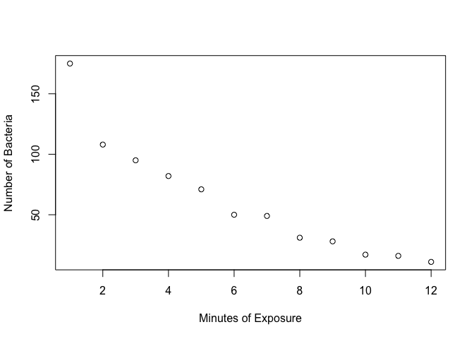<!-- -->

It does not appear that a straight-line model will be adequate because
minutes of exposure seems to asymptotically approach zero, slope getting
less negative as minutes of exposure increases.

### Part (b)

``` r
plot(minExp, numBact, xlab="Minutes of Exposure", ylab="Number of Bacteria")
fit = lm(numBact ~ minExp)
abline(fit, col="red")
```

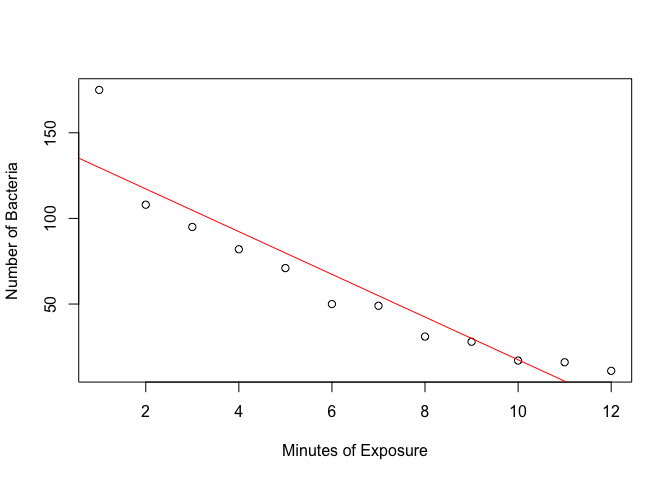<!-- -->

``` r
summary(fit)
```

    ## 
    ## Call:
    ## lm(formula = numBact ~ minExp)
    ## 
    ## Residuals:
    ##     Min      1Q  Median      3Q     Max 
    ## -17.323  -9.890  -7.323   2.463  45.282 
    ## 
    ## Coefficients:
    ##             Estimate Std. Error t value Pr(>|t|)    
    ## (Intercept)   142.20      11.26  12.627 1.81e-07 ***
    ## minExp        -12.48       1.53  -8.155 9.94e-06 ***
    ## ---
    ## Signif. codes:  0 '***' 0.001 '**' 0.01 '*' 0.05 '.' 0.1 ' ' 1
    ## 
    ## Residual standard error: 18.3 on 10 degrees of freedom
    ## Multiple R-squared:  0.8693, Adjusted R-squared:  0.8562 
    ## F-statistic: 66.51 on 1 and 10 DF,  p-value: 9.944e-06

``` r
rStuRes = rstudent(fit)
qqnorm(rStuRes, datax = TRUE, main="Normal Probability Plot")
qqline(rStuRes, datax = TRUE)
```

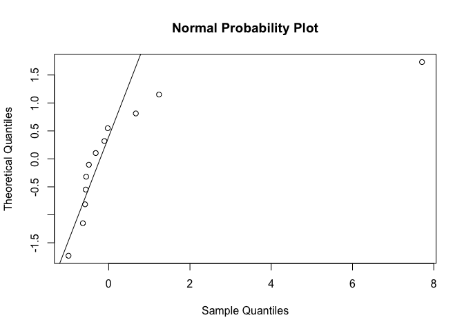<!-- -->

``` r
plot(predict(fit), rStuRes, main = "Residuals vs. Predicted Response",xlab="Predicted Response",ylab="Residual")
abline(0,0)
```

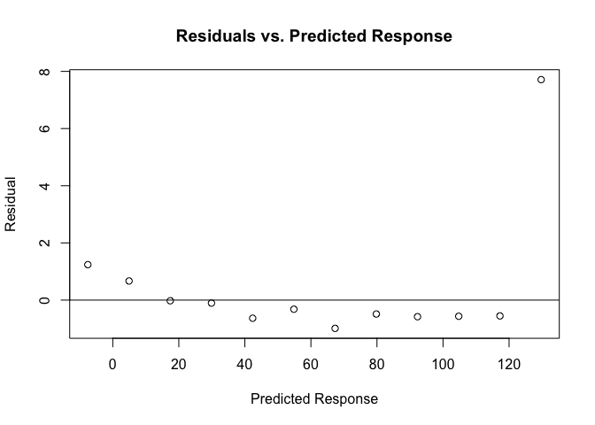<!-- -->

``` r
SS_res_b = sum((numBact - predict(fit))^2)
SS_t = sum((numBact - mean(numBact))^2)
MS_res_b = SS_res_b/(n - (k+1))
```

With a straight-line model we obtain *R*<sup>2</sup> and adjusted
*R*<sup>2</sup> values of 0.869 and 0.856 respectively, suggesting a
decent fit to the data. And MSres is calculated to be 334.810373. Yet
there is an issue with the normality assumption because of the residuals
deviating away from the line in the Normal Probability plot, resembling
negative skew. There is also a pattern in the Residuals vs. Predicted
Responses plot, implying nonlinearity. Lastly, there seems to be an
outlier, namely the first observation of minExp = 1, numBact = 175.

### Part (c)

``` r
new_minExp = log(minExp)
plot(new_minExp, numBact,xlab="log(minutes of exposure)",ylab="number of bacteria",main="Number of Bacteria vs log(Minutes of Exposure)")
fit2 = lm(numBact ~ new_minExp)
abline(fit2$coefficients,col="red")
```

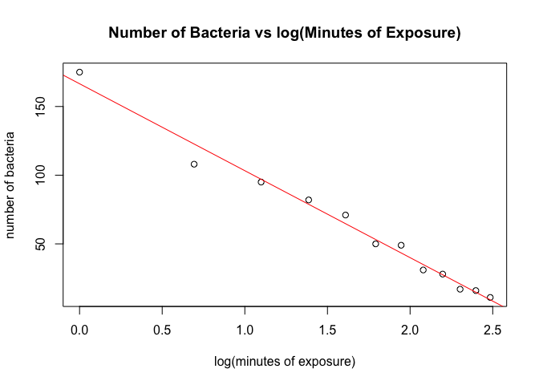<!-- -->

``` r
summary(fit2)
```

    ## 
    ## Call:
    ## lm(formula = numBact ~ new_minExp)
    ## 
    ## Residuals:
    ##      Min       1Q   Median       3Q      Max 
    ## -14.6638  -3.2574   0.9354   3.8390   8.4427 
    ## 
    ## Coefficients:
    ##             Estimate Std. Error t value Pr(>|t|)    
    ## (Intercept)  166.557      4.679   35.60 7.26e-12 ***
    ## new_minExp   -63.325      2.576  -24.58 2.84e-10 ***
    ## ---
    ## Signif. codes:  0 '***' 0.001 '**' 0.01 '*' 0.05 '.' 0.1 ' ' 1
    ## 
    ## Residual standard error: 6.459 on 10 degrees of freedom
    ## Multiple R-squared:  0.9837, Adjusted R-squared:  0.9821 
    ## F-statistic: 604.1 on 1 and 10 DF,  p-value: 2.837e-10

``` r
stdRes = rstandard(fit2)
rStuRes = rstudent(fit2)
qqnorm(rStuRes, datax = TRUE, main="Normal Probability Plot for Transformed Model")
qqline(rStuRes, datax = TRUE)
```

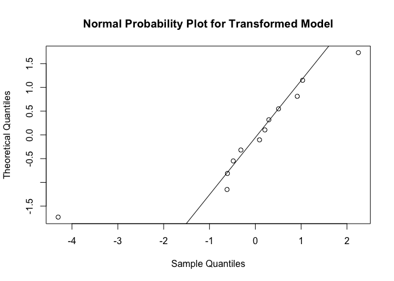<!-- -->

``` r
plot (predict(fit2), rStuRes, main = "Residuals vs. Predicted Response for Transformed Model",xlab="New Predicted Response",ylab="Residual")
abline(0,0)
```

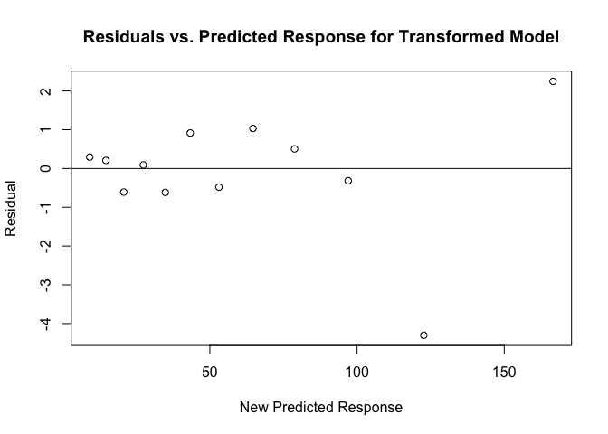<!-- -->

``` r
SS_res_c = sum((numBact - predict(fit2))^2)
SS_t = sum((numBact - mean(numBact))^2)
MS_res_c = SS_res_c/(n - (k+1))
```

The transformed model describes number of bacteria regressed with the
natural logarithm of minutes of exposure. This yields higher
*R*<sup>2</sup> and adjusted *R*<sup>2</sup> values of 0.984 and 0.982
respectively, suggesting a better fit to the data than the straight-line
model. MSres is `r`MS\_res\_c\`, which is lower than the MSres for the
straight-line model, implying lower variance due to the transformed
model. There is a minor issue with the normality assumption as the
residuals are fairly close to the line and farther at the extremes in
the Normal Probability plot, but note that observation 1 is clearly an
outlier. There is not much of a pattern in the Residuals vs. Predicted
Responses plot, so there is less of a case for nonlinearity, but the
outlier continues to be an issue. In conclusion, the transformed model
is pretty adequate in representing the data.")
